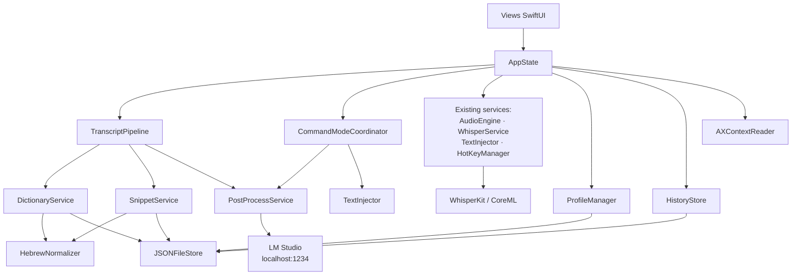
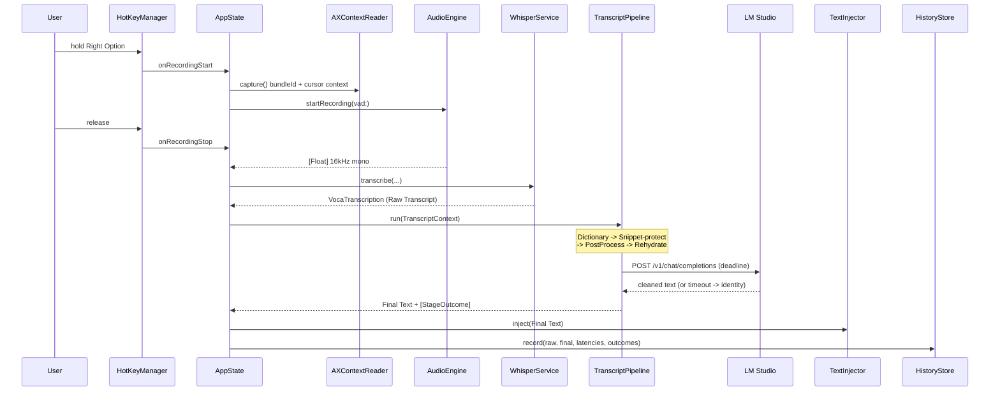
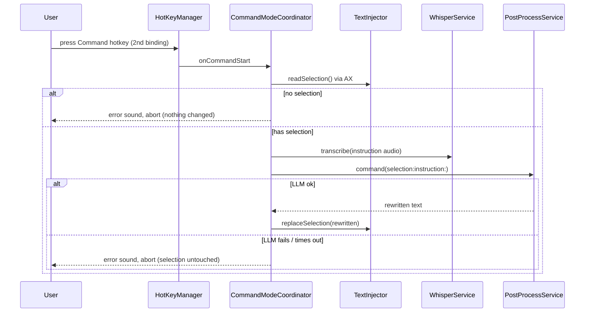
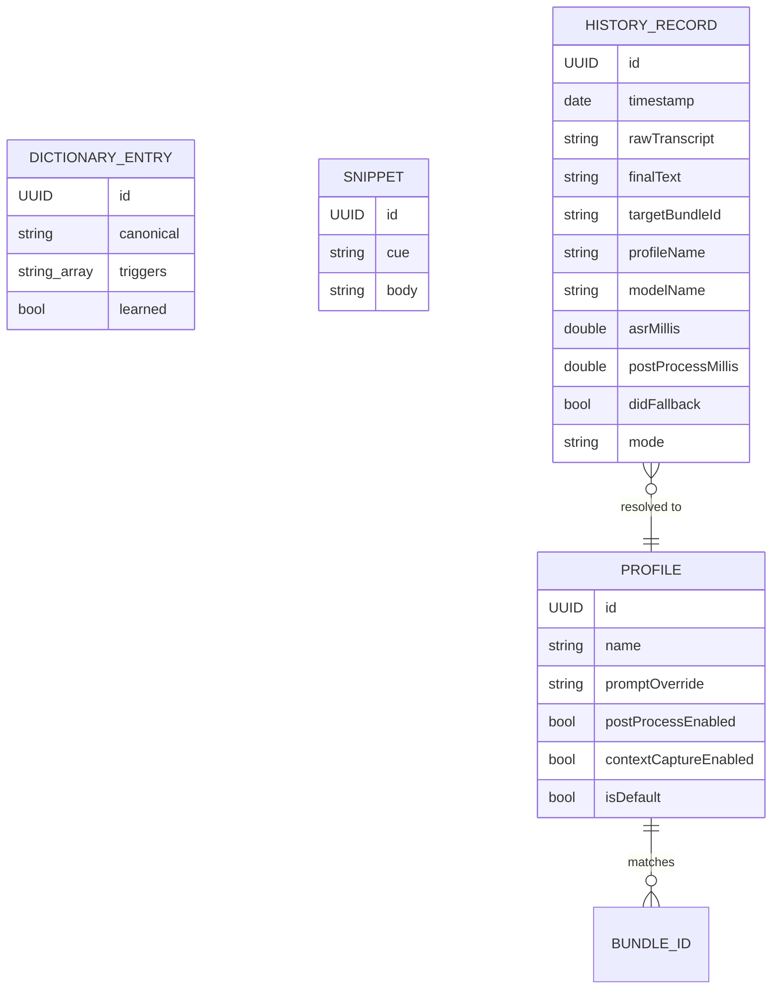

# Architecture Spine — local-whisper

## Design Paradigm

**Pipes-and-filters, layered on the existing protocol-injected service architecture.**

The existing app is a straight line: capture → transcribe → inject. Every feature in the PRD adds a transformation between transcription and injection. Adding them as six inline calls inside `AppState.stopRecordingAndTranscribe()` would turn a 25-line method into an unreadable 150-line one and make each stage untestable in isolation.

Instead: one ordered **pipeline** of independent **stages**, each a pure-ish transformation over a shared context value. `AppState` gains exactly one new call at the existing seam. Stages are added, reordered, or disabled without touching `AppState` again.

| Layer | Lives in | Role |
| --- | --- | --- |
| Presentation | `Sources/VocaMac/Views/` | SwiftUI, `@EnvironmentObject var appState: AppState` |
| Coordination | `Sources/VocaMac/Models/AppState.swift` | `@MainActor` orchestrator; owns status, wires callbacks |
| **Pipeline (new)** | `Sources/VocaMac/Pipeline/` | `TranscriptStage` chain + `TranscriptContext` |
| Services | `Sources/VocaMac/Services/` | Capability owners behind protocols in `ServiceProtocols.swift` |
| Stores (new) | `Sources/VocaMac/Stores/` | JSON-file persistence for profiles, dictionary, snippets, history |
| Models | `Sources/VocaMac/Models/` | Value types: `ModelSize`, `VocaTranscription`, new records |

The **pipes-and-filters** pattern buys the property that matters most in this product: every filter is individually bypassable, and a failed filter yields its input unchanged. That is exactly FR-5's transparent-fallback requirement, generalized to every stage.

## Inherited Invariants

The existing codebase is the parent. These are settled realities that bind all new work — they are not re-decided here.

| Inherited | From | Binds here |
| --- | --- | --- |
| `@MainActor` + GCD, **no `actor` declarations** | Whole codebase (grep-verified) | New services must not introduce `actor`. See AD-8. |
| Swift tools 5.9, macOS 13, **no strict-concurrency flags** | `Package.swift:1` | `@unchecked Sendable` remains the escape hatch of record. |
| Services declared as protocols, injected with concrete defaults | `Services/ServiceProtocols.swift` (9 protocols) | Every new service gets a protocol here first. See AD-7. |
| `@AppStorage` on `AppState`, key convention `vocamac.<camelCase>` | `AppState.swift:95-112` | New scalar settings follow it verbatim. See AD-9. |
| JSON to `~/Library/Application Support/VocaMac/` on a `.utility` serial queue | `StatsManager.swift:24-38` | The persistence precedent for all new stores. See AD-10. |
| `TextInjector` two-strategy injection with pasteboard snapshot/restore | `TextInjector.swift:59-274` | Untouchable. New code calls it; it does not change. |
| `WhisperService` is the **only** WhisperKit boundary | `WhisperService.swift` | VAD, chunking, and streaming changes land here or in `AudioEngine`, nowhere else. |
| Hallucination filtering happens inside transcription | `WhisperService.filterHallucinationTokens` (`:271`) | Stays where it is; the pipeline starts *after* it. |
| Project remains **AGPL-3.0**; VoiceInk (GPL-3) is design reference only | PRD §10 | No code copied from VoiceInk under any circumstance. |

## Invariants & Rules

### AD-1 — All post-ASR text transformation happens in the pipeline, never in `AppState`

- **Binds:** FR-4, FR-15, FR-19, and every future text-transforming feature
- **Prevents:** `stopRecordingAndTranscribe()` accreting one inline call per feature until it is untestable and unreviewable
- **Rule:** `AppState.stopRecordingAndTranscribe()` gains exactly **one** new call — `await transcriptPipeline.run(context)` — inserted at the existing seam between `let trimmedText = ...` (`AppState.swift:633`) and the `if !trimmedText.isEmpty` injection guard (`:634`). Any new text transformation is a `TranscriptStage`, not a new line in `AppState`.

### AD-2 — Every stage degrades to identity

- **Binds:** FR-5, FR-15, FR-19, and all stages
- **Prevents:** A new feature making dictation *worse* than the current baseline — the single largest product risk in this plan
- **Rule:** A stage that is disabled, errors, times out, or produces output failing its own validity check **returns its input unchanged**. Stages never throw out of `run`; they catch internally, record a `StageOutcome`, and pass the text through. With every new feature toggled off, the pipeline is a no-op and the app's behavior is byte-identical to commit `8123a20`. This is a testable property, not an aspiration — see the pipeline test requirement in AD-13.

### AD-3 — Stage order is fixed and semantically justified

- **Binds:** FR-4, FR-15, FR-19
- **Prevents:** Snippet bodies being rewritten by the LLM; the LLM being fed ASR errors the Dictionary could have fixed first
- **Rule:** The order is **Dictionary → Snippet-protect → PostProcess → Snippet-rehydrate**, and it does not change without amending this AD.
  - **Dictionary runs first** because it repairs *ASR errors*. The LLM should reason over corrected terms, not garbled ones.
  - **Snippets protect before the LLM, rehydrate after.** A Cue is spoken verbatim, so it is only reliably detectable in pre-LLM text; but a signature block handed to an LLM will be "improved". So `SnippetStage` replaces each matched Cue with an opaque placeholder token, records the mapping on the context, and `RehydrateStage` substitutes the real bodies after post-processing. The LLM sees a placeholder it has no reason to touch.
  - **Placeholder tokens** must be a form the LLM will not alter or translate. Use `⟦S0⟧`, `⟦S1⟧`, … and validate on rehydrate: if a placeholder is missing from the LLM output, the whole post-processing result is rejected under AD-2 and the pre-LLM text is used.

### AD-4 — Command Mode is a separate route, and it does **not** fall back

- **Binds:** FR-21, FR-22
- **Prevents:** A failed rewrite silently pasting the user's spoken instruction over their selected text — a destructive, unrecoverable outcome
- **Rule:** Command Mode does not use `TranscriptPipeline`. It is coordinated by `CommandModeCoordinator`, which reads the selection, transcribes the instruction, calls `PostProcessService` in command mode, and writes back. **AD-2's identity-fallback is explicitly inverted here:** on any failure — no selection, LLM unreachable, timeout, unwritable target — the operation **aborts and changes nothing**. The transcribed instruction is never injected anywhere.

### AD-5 — Cursor Context is read once, at recording start, and never persisted

- **Binds:** FR-12, FR-14, NFR privacy
- **Prevents:** Resolving the wrong Profile when the user switches windows mid-dictation; leaking the contents of the user's documents into a log or history file
- **Rule:** The frontmost application's bundle identifier **and** the Cursor Context are captured in a single `AXContextReader.capture()` at the moment recording starts, not when it ends. The captured context lives on `TranscriptContext` for the duration of one pipeline run and is discarded. It is **never** written to `HistoryStore`, never passed to `VocaLogger` at any level, and never included in a diagnostic export. Only the bundle identifier and resolved Profile name are persisted.

### AD-6 — The LLM Backend is reached through one client, over loopback, with a hard deadline

- **Binds:** FR-4, FR-5, FR-6, FR-7, FR-21
- **Prevents:** Ad-hoc `URLSession` calls scattered across features; an unresponsive LM Studio hanging a dictation indefinitely
- **Rule:** All LLM traffic goes through `PostProcessService`, which owns the only HTTP client. Every request carries an explicit timeout enforced by `URLSession` configuration **and** an outer `Task` deadline. The endpoint is user-configurable but defaults to `http://localhost:1234`; the request shape is OpenAI chat-completions. The service exposes intent-specific entry points (`clean(...)`, `command(...)`) rather than a raw `send(prompt:)`, so prompt construction stays testable and centralized.

### AD-7 — Every new service is declared as a protocol in `ServiceProtocols.swift` and mocked

- **Binds:** all FRs
- **Prevents:** Untestable `AppState` — the existing test suite depends entirely on `AppState.makeTestState` being able to substitute every collaborator
- **Rule:** A new service is added to `Sources/VocaMac/Services/ServiceProtocols.swift` as a protocol, injected into `AppState.init` as a `let` with a concrete default, given a `Mock<Name>` in `Tests/VocaMacTests/Mocks/MockServices.swift`, and threaded through `TestMocks` and `AppState.makeTestState`. Where default arguments are needed on a protocol requirement, use the existing `_`-prefixed-requirement + defaulted-extension idiom already used for `_loadModel` and `_updateConfiguration`.

### AD-8 — Match the existing concurrency idioms; do not modernize

- **Binds:** NFR concurrency safety
- **Prevents:** A half-migration to actors and strict concurrency that leaves the codebase in two dialects
- **Rule:** No `actor` declarations. No enabling strict concurrency in this effort. Use the established idioms:
  - UI-observable services: `@MainActor final class X: ObservableObject, XProtocol` (precedent: `StatsManager`, `PermissionManager`).
  - Stateless/computational services: `final class X: @unchecked Sendable` or, preferably, a `struct` conforming to `Sendable` when there is no mutable state (precedent: `WhisperService` for the former; new pure stages should be the latter).
  - Callback → async bridge: `Task { @MainActor in ... }` (precedent: `AppState.swift:333-392`).
  - MainActor → background bridge: `withCheckedContinuation` + `DispatchQueue.global(qos: .userInitiated)` with an `@unchecked Sendable` worker shim (precedent: `AppState.startAudioEngine`, `:660`).
  - Async HTTP is the exception: `URLSession`'s `async` API hops off the main actor by itself. `await postProcessService.clean(...)` from `AppState` needs no manual shim.
  - **Never** block the main thread on network or disk. The regression test `testStartRecordingDoesNotBlockMainActorDuringAudioStart` exists because this was violated before.

### AD-9 — Scalar settings use `@AppStorage`; collections use JSON files

- **Binds:** FR-6, FR-13, FR-17, FR-20
- **Prevents:** Serializing arrays into `UserDefaults` strings, which makes export/import and diffing miserable
- **Rule:** A single-value setting (a toggle, a URL, a timeout) is `@AppStorage("vocamac.<camelCaseName>")` on `AppState`, matching the 18 existing keys. A **collection** — Profiles, Dictionary Entries, Snippets, History Records — is a JSON file under `~/Library/Application Support/VocaMac/`. Nested feature keys use a second dotted segment, matching `vocamac.update.lastCheck` (`UpdateChecker.swift:110`): e.g. `vocamac.postProcess.enabled`, `vocamac.postProcess.endpoint`.

### AD-10 — All collection persistence goes through one `JSONFileStore`

- **Binds:** FR-8, FR-13, FR-17, FR-20
- **Prevents:** Four independently-written, independently-buggy load/save/atomic-write implementations
- **Rule:** A single generic `JSONFileStore<T: Codable>` in `Sources/VocaMac/Stores/` owns file location, atomic write, decode-failure recovery, and the background save queue — modeled directly on `StatsManager.swift:24-38`. It writes on a serial `.utility` queue and never blocks the caller. A corrupt or unreadable file yields the type's empty/default value and logs; it never crashes and never blocks startup. Profiles, Dictionary, Snippets, and History are each an instance of it.

### AD-11 — The side-loaded model must bypass `isModelSupported`

- **Binds:** FR-1, FR-2
- **Prevents:** The ivrit.ai model being invisible in the picker and unloadable — a silent, confusing dead end
- **Rule:** `ModelManager.isModelSupported(_:)` (`ModelManager.swift:285`) gates on `WhisperKit.recommendedModels()`, which will **never** return a custom local model. Therefore the ivrit.ai entry must be added to `ModelSize.standardCatalog` (`WhisperModel.swift:32`) and special-cased in `isModelSupported` to report support based on **on-disk presence** rather than WhisperKit's endorsement. Additionally: `download` must be suppressed for this entry, and `AppState.startupFallbackModel(for:)` (`:460`) must not select it when its files are absent.

### AD-12 — VAD governs the stop decision only; RMS still drives the level meter

- **Binds:** FR-23
- **Prevents:** A dead or jittery audio-level indicator as a side effect of a stop-logic change
- **Rule:** `AudioEngine.calculateRMSEnergy` (`AudioEngine.swift:546`) and the ~15 Hz `onAudioLevel` reporting path (`:457-461`) are **retained unchanged** — they feed the cursor overlay animation. Only the threshold comparison at `:486-495` is replaced, delegating to a `VoiceActivityDetecting` collaborator. The legacy RMS behavior ships as `RMSThresholdDetector`, remains user-selectable, and is the fallback if VAD regresses.

### AD-13 — The identity property is a test, not a promise

- **Binds:** AD-2, NFR backwards compatibility
- **Prevents:** Fallback rotting silently as stages are added
- **Rule:** A test asserts that with all new features disabled, `TranscriptPipeline.run` returns its input string unchanged, byte for byte, for a corpus of inputs including Hebrew with niqqud, mixed Hebrew/English, and empty/whitespace strings. Every new stage must keep this test green. Additionally, every stage's failure path is unit-tested with an injected failing collaborator.

### Dependency direction



Rules readable off the graph: **nothing depends on `Views`**; **no service depends on `AppState`**; **stages depend on services, never on each other**; `HebrewNormalizer` is a leaf with no dependencies and is therefore trivially testable; `PostProcessService` is the only node touching the network.

## Consistency Conventions

| Concern | Convention |
| --- | --- |
| Service naming | `<Capability>Service` for stateless capability owners; `<Thing>Manager` for lifecycle/state owners; `<Thing>Store` for persistence. Protocol is the gerund: `PostProcessing`, `DictionaryProviding`, `HistoryRecording`, `VoiceActivityDetecting`. |
| File placement | New services → `Sources/VocaMac/Services/`. New pipeline types → `Sources/VocaMac/Pipeline/`. New persistence → `Sources/VocaMac/Stores/`. New value types → `Sources/VocaMac/Models/`. New settings tabs → `Sources/VocaMac/Views/`, one file per tab (precedent: `StatsSettingsTab.swift`). |
| Test placement | `Tests/VocaMacTests/<Feature>Tests.swift`; mocks appended to `Mocks/MockServices.swift` and exposed via `TestMocks`. |
| Settings keys | `vocamac.<camelCase>`; nested features `vocamac.<feature>.<camelCase>`. |
| Data files | `~/Library/Application Support/VocaMac/<name>.json`, atomic write, `.utility` serial queue. |
| Identifiers | Every persisted record carries a `UUID id`. Profiles, entries, and snippets are `Identifiable` + `Codable`. |
| Dates | `Date` in-model; ISO-8601 via `JSONEncoder.dateEncodingStrategy = .iso8601` on the wire. |
| Errors | Per-service `enum <Name>Error: Error` (precedent: `WhisperError`, `ModelManagerError`). Pipeline stages **do not** propagate errors — they record a `StageOutcome` and pass through (AD-2). |
| Logging | `VocaLogger` with a new `LogCategory` per service (`postProcess`, `pipeline`, `profiles`, `dictionary`, `snippets`, `history`, `commandMode`, `vad`). **Never** log transcript bodies at `info`; never log Cursor Context at any level (AD-5). |
| Prompts | Default prompts live in one `Prompts.swift` as `static let` constants, so "restore default" (FR-6) has a single source of truth. |
| Feature flags | Every new capability has an explicit `@AppStorage` on/off. Default **off** for: Cursor Context (FR-14), correction learning (FR-18), streaming (FR-25). Default **on** for post-processing once it is proven, but shipped off in the story that introduces it. |

## Stack

| Name | Version |
| --- | --- |
| Swift (tools) | 5.9 |
| macOS deployment target | 13.0 |
| WhisperKit | 0.18.0 |
| swift-transformers | 1.1.9 |
| Qwen3-4B-Instruct (Q4, via LM Studio) | external, user-managed |
| LM Studio HTTP API | OpenAI-compatible, `http://localhost:1234` |
| XCTest | bundled |

New third-party dependencies: **none.** Every capability in this plan is built on Foundation, AppKit, ApplicationServices (AX), AVFoundation, and WhisperKit's existing surface. This is deliberate — it keeps the offline guarantee auditable and avoids license entanglement.

## Structural Seed

### New and changed source tree

```text
Sources/VocaMac/
  Pipeline/                        # NEW
    TranscriptContext.swift        # value carried through the chain
    TranscriptStage.swift          # protocol + StageOutcome
    TranscriptPipeline.swift       # ordered runner (AD-1, AD-2, AD-3)
    Stages/
      DictionaryStage.swift
      SnippetStage.swift           # cue -> placeholder
      PostProcessStage.swift       # LLM call
      RehydrateStage.swift         # placeholder -> body
  Stores/                          # NEW
    JSONFileStore.swift            # AD-10
    ProfileStore.swift
    DictionaryStore.swift
    SnippetStore.swift
    HistoryStore.swift
  Services/
    PostProcessService.swift       # NEW - the only network boundary (AD-6)
    ProfileManager.swift           # NEW - bundle id -> Profile
    DictionaryService.swift        # NEW - fuzzy replacement
    SnippetService.swift           # NEW - cue expansion
    AXContextReader.swift          # NEW - frontmost app + cursor context (AD-5)
    CommandModeCoordinator.swift   # NEW - the second route (AD-4)
    VoiceActivityDetector.swift    # NEW - EnergyVAD + RMS legacy (AD-12)
    ServiceProtocols.swift         # CHANGED - +7 protocols (AD-7)
    AudioEngine.swift              # CHANGED - VAD delegation at :486-495
    WhisperService.swift           # CHANGED - chunkingStrategy, streaming
    ModelManager.swift             # CHANGED - side-loaded model support (AD-11)
  Models/
    HebrewNormalizer.swift         # NEW - pure, leaf, heavily tested
    Profile.swift                  # NEW
    DictionaryEntry.swift          # NEW
    Snippet.swift                  # NEW
    HistoryRecord.swift            # NEW
    Prompts.swift                  # NEW - default prompt constants
    WhisperModel.swift             # CHANGED - ivrit.ai ModelSize case
    AppState.swift                 # CHANGED - one pipeline call + wiring
  Views/
    HistoryView.swift              # NEW
    PostProcessSettingsTab.swift   # NEW
    ProfilesSettingsTab.swift      # NEW
    VocabularySettingsTab.swift    # NEW - Dictionary + Snippets
    SettingsView.swift             # CHANGED - +3 tabs
    MenuBarView.swift              # CHANGED - history, re-paste, undo
```

### Dictation data flow



The **only** change to `AppState`'s existing flow is the `P` interaction. Everything left of it is untouched; everything right of it already exists.

### Command Mode flow



### Core entities



Note the absence of any relationship from `HISTORY_RECORD` to Cursor Context. That is AD-5 expressed as a schema constraint.

## Capability → Architecture Map

| Capability | Lives in | Governed by |
| --- | --- | --- |
| FR-1, FR-2 ivrit.ai model | `Models/WhisperModel.swift` (`ModelSize` + 5 exhaustive switches at `:49,67,92,110,128`), `Services/ModelManager.swift` (`whisperKitModelName` `:233`, `isModelSupported` `:285`), `AppState.modelCatalog()` `:419` | AD-11 |
| FR-3 latency instrumentation | `Pipeline/TranscriptContext.swift`, `Stores/HistoryStore.swift` | AD-10 |
| FR-4–FR-7 post-processing | `Services/PostProcessService.swift`, `Pipeline/Stages/PostProcessStage.swift`, `Views/PostProcessSettingsTab.swift` | AD-2, AD-6 |
| FR-8–FR-11 history | `Stores/HistoryStore.swift`, `Models/HistoryRecord.swift`, `Views/HistoryView.swift`, `Views/MenuBarView.swift` | AD-5, AD-10 |
| FR-12–FR-14 profiles + context | `Services/ProfileManager.swift`, `Services/AXContextReader.swift`, `Stores/ProfileStore.swift`, `Views/ProfilesSettingsTab.swift` | AD-5 |
| FR-15–FR-18 dictionary | `Services/DictionaryService.swift`, `Models/HebrewNormalizer.swift`, `Pipeline/Stages/DictionaryStage.swift` | AD-2, AD-3 |
| FR-19–FR-20 snippets | `Services/SnippetService.swift`, `Pipeline/Stages/SnippetStage.swift`, `Pipeline/Stages/RehydrateStage.swift` | AD-3 |
| FR-21–FR-22 command mode | `Services/CommandModeCoordinator.swift`, `Services/HotKeyManager.swift` (2nd binding), `Services/TextInjector.swift` (selection read/write) | AD-4 |
| FR-23–FR-24 VAD | `Services/VoiceActivityDetector.swift`, `Services/AudioEngine.swift` (`:486-495`), `Services/WhisperService.swift` (`DecodingOptions` `:168-179`) | AD-12 |
| FR-25 streaming | `Services/WhisperService.swift` (`AudioStreamTranscriber`), `Services/CursorOverlayManager.swift` | AD-2 |

## Failure and Fallback Behavior

The controlling table. Every row is a testable assertion.

| Failure | Detected by | Behavior | User sees |
| --- | --- | --- | --- |
| LM Studio not running | `URLError.cannotConnectToHost` | Identity: Raw Transcript injected | Normal dictation, no dialog |
| LLM slower than timeout | `URLSession` timeout + outer `Task` deadline | Request cancelled, Raw Transcript injected | Normal dictation, delayed by ≤ timeout |
| LLM returns non-2xx / bad JSON | Status + decode check | Identity | Normal dictation |
| LLM returns empty or wildly disproportionate output | Length-ratio guard in `PostProcessService` | Identity | Normal dictation |
| LLM drops a snippet placeholder | `RehydrateStage` validation | Post-processing result rejected wholesale; pre-LLM text used | Snippet intact, text uncleaned |
| ivrit.ai model files missing | `ModelManager` on-disk validation | Entry shown "Not installed", unselectable; startup falls back to a known-good model | One clear message with expected path |
| AX read returns nothing | `AXContextReader` nil result | Pipeline proceeds without context | Nothing |
| Dictionary match below threshold | `DictionaryService` | No replacement (conservative miss) | Nothing |
| History file corrupt | `JSONFileStore` decode failure | Empty history, file quarantined, logged | Empty history list |
| **Command Mode: no selection** | `TextInjector` selection read | **Abort, nothing written** | Error sound |
| **Command Mode: LLM fails** | Same as above | **Abort, selection untouched** | Error sound |
| Undo on a clipboard-injected target | Best-effort ⌘Z | May not retract | Undo offered but documented as best-effort |
| VAD regresses on real speech | User judgment | `RMSThresholdDetector` remains selectable | Setting to revert |

## Threading Notes

| Component | Isolation | Rationale |
| --- | --- | --- |
| `TranscriptPipeline` | `@MainActor`, `async` | Called from `AppState` (already MainActor) at `:633`. Stages `await`; the LLM call hops off via `URLSession` on its own. Keeping the runner MainActor avoids a Sendable audit of the whole context type under Swift 5 mode. |
| `TranscriptContext` | `struct`, value type | Passed by value between stages; no sharing, no races by construction. |
| `PostProcessService` | `final class: @unchecked Sendable` | Stateless apart from a `URLSession`. Precedent: `WhisperService`. `async` methods; never touches UI. |
| `HebrewNormalizer` | `enum` with `static` pure functions | No state. Trivially concurrency-safe and the easiest thing in the codebase to unit-test. |
| `DictionaryService`, `SnippetService` | `struct: Sendable` | Constructed with a snapshot of entries; pure `apply(to:)`. Re-created when the store changes. |
| `ProfileManager` | `@MainActor final class: ObservableObject` | Drives settings UI. Precedent: `StatsManager`. |
| `HistoryStore` | `@MainActor final class: ObservableObject` + `.utility` save queue | UI-observable list; writes off-main. Precedent: `StatsManager.swift:24-38` exactly. |
| `AXContextReader` | `@MainActor` | AX APIs must be called from the main thread. Its one method is fast and bounded. |
| `CommandModeCoordinator` | `@MainActor final class` | Orchestrates UI-adjacent AX reads/writes plus `await`ed transcription and LLM calls. |
| `VoiceActivityDetector` | `final class: @unchecked Sendable` | Called from the `AVAudioEngine` tap thread — **not** main. Must hold no UI state and take no locks the tap could contend on. Same constraints as the existing `calculateRMSEnergy` call site. |
| `JSONFileStore` | `final class: @unchecked Sendable` | Serial `.utility` `DispatchQueue` for writes; in-memory snapshot for reads. |

**Hard rules:**
- Nothing on the audio tap thread may allocate unboundedly, block, or call into `@MainActor` code synchronously. `VoiceActivityDetector` must be allocation-free in steady state.
- No network or file I/O on the main thread. `URLSession async` and the store's `.utility` queue are the sanctioned paths.
- `AppState` remains the only orchestrator. Services do not call back into `AppState` except through the existing closure-callback convention (`Task { @MainActor in ... }`).

## Risks

| # | Risk | Impact | Mitigation |
| --- | --- | --- | --- |
| R-1 | `AudioStreamTranscriber` may own its own audio capture, conflicting with `AudioEngine`'s installed tap | Streaming (FR-25) could require re-architecting capture — the most invasive change in the plan | **Spike before committing.** FR-25 is deliberately last and off by default. If the conflict is real, cut the feature; its value is perceptual (SM-C3). |
| R-2 | `isModelSupported` gates on `WhisperKit.recommendedModels()`; a custom model is never endorsed | ivrit.ai model invisible/unloadable — Phase 1's headline feature silently fails | AD-11 mandates the bypass. Story 1.1 must verify the model actually appears **and loads**, not just that the enum compiles. |
| R-3 | Qwen3-4B Q4 Hebrew instruction-following is unverified | Post-processing could mangle Hebrew rather than clean it | Prompt work is empirical (PRD §9.1). Service contract is backend-agnostic; DictaLM 2.0 is the swap-in fallback. Ship post-processing off by default. |
| R-4 | Adding a `ModelSize` case requires arms in **5** exhaustive switches plus `ModelManager` plus 2 string ladders (`WhisperService.modelSizeFromName` `:310`, `AppState.loadModel` `:749-772`) | Easy to miss one and get a runtime surprise | Enumerated explicitly in AD-11 and in Story 1.1's acceptance criteria. Compiler catches the switches; the two string ladders it will not. |
| R-5 | Second hotkey binding requires touching `HotKeyManager`'s 643-line dual state machine | Regression in the app's most load-bearing input path | Add a second binding to the **existing** tap with dedicated callbacks rather than generalizing the state machine. `HotKeyManagerConfigurationTests` and `_handleTestEvent` (`:458`) give a safety net; extend them first. |
| R-6 | Correction-learning (FR-18) may be noisy in real editing | A stream of bad suggestions makes the feature worse than nothing | Off by default, proposal-only, word-level bounded diff. If noisy, it stays off (PRD §9.3). |
| R-7 | LLM + large ASR model resident together on 24 GB | Memory pressure, swapping, latency collapse | FR-3 instrumentation lands in Phase 1 to measure it. Do not run ASR and LLM inference concurrently. |
| R-8 | Cursor Context is the highest-privacy-cost feature here | A logging mistake leaks document contents to disk | AD-5 forbids persistence and logging; off by default; enforced by the schema (no field exists to hold it) and by an explicit test. |
| R-9 | Undo (FR-10) is unreliable on clipboard-injected targets | User expects retraction, gets none | Scoped as best-effort in FR-10; stated in UI; unavailable rather than destructive when unsafe. |

### Pre-existing defects found during grounding

Not caused by this work, but they intersect it and should be fixed in the stories that touch the same code.

| Defect | Location | Intersects |
| --- | --- | --- |
| `selectedLanguage` defaults to `"he"` but the Settings language `Picker` has **no Hebrew option** — a user who touches the picker cannot get back to Hebrew | `SettingsView.swift:110-135` vs `AppState.swift:105` | Story 1.1 (model/language UI) — fix there |
| `vocamac.logLevel` is declared but dead; `VocaLogger.setLogLevel(_:)` has zero callers | `AppState.swift:112`, `Logger.swift:80` | Logging conventions; low priority |
| `WhisperService.transcriptionLock` (`NSLock`) is declared and never used; the "prevents concurrent transcription" comment describes unimplemented behavior | `WhisperService.swift:48` | Streaming work (FR-25) — either use it or delete it |

## Deferred

- **Multiple LLM backends** (Ollama, llama.cpp, cloud). `PostProcessService` keeps the endpoint configurable, which is 90% of the work, but no second backend is built or tested. Revisit if LM Studio proves inconvenient.
- **Encrypted history at rest.** Disk encryption is the boundary. Revisit only if history is ever extended to hold Cursor Context — which AD-5 currently forbids.
- **Per-Profile ASR model.** Model load cost makes mid-session switching impractical. Revisit if load times drop substantially.
- **Streaming injection** of partial results. Permanently out — partial hypotheses revise themselves (SM-C3).
- **Phonetic Hebrew matching.** No soundex-equivalent exists. Edit distance over normalized forms is v1; revisit only if miss rate proves unacceptable.
- **Strict concurrency / Swift 6 migration.** Explicitly out of scope (AD-8). Worth doing eventually, as its own effort, not smuggled into feature work.
- **Sync.** JSON export/import covers the multi-machine case (FR-13). No sync service, ever, per PRD §5.
